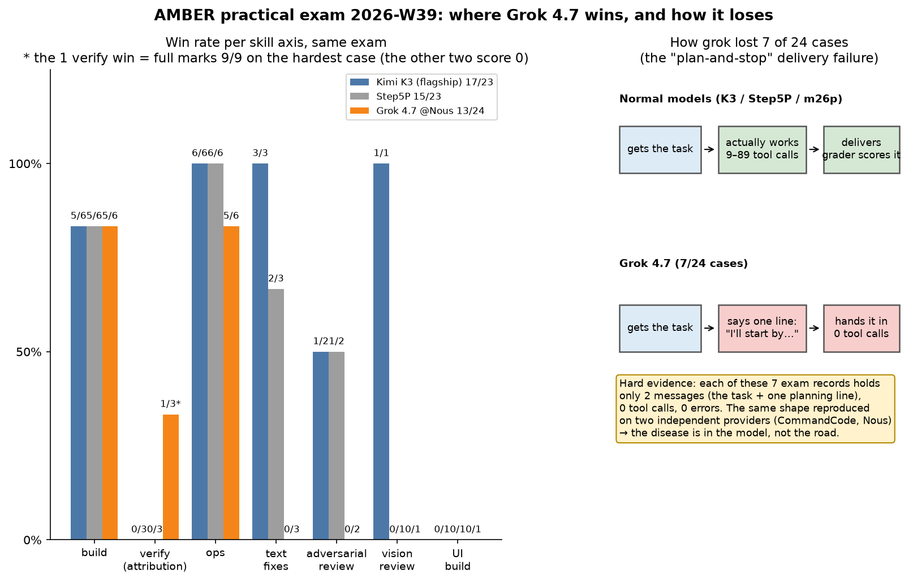

# For non-technical readers: where Grok 4.7 wins, and how it loses (2026-W39)

> This is the plain-language version of [results/2026-W39.en.md](../../results/2026-W39.en.md), written for smart readers with no AI-benchmarking background. After reading it you should be able to retell the conclusion to a friend without distortion. 中文: [2026-W39-g47-plain.md](2026-W39-g47-plain.md)

## What this exam is

We run a private question bank called **AMBER** — a practical "job tryout" for AI models. No multiple choice: the model gets real work. Fix a bug. Write a program. Find the root cause from evidence. Review a screenshot. Operate a system. The full bank is **24 cases**, graded by an automatic judge. Questions are never published; results are.

Three candidates sat the same exam: **Kimi K3** (our fleet's current workhorse), **Step5P**, and **Grok 4.7** (xAI's new flagship; Nous Portal ran a half-price week, so the full exam cost us about **$10.70** and 54 minutes).

## Headline scores

- Kimi K3: **17/23**
- Step5P: **15/23**
- Grok 4.7: **13/24** — last place

But the total is misleading. Break it down by skill axis (chart, left panel):

## Axis by axis

- **Build: 5/6 — a three-way tie.** Four of those wins are full marks. On construction work its raw ability matches the flagship.
- **Verify (root-cause/defense): Grok pulls ahead, 1/3.** The one win is the hardest case in the bank — full marks, 9/9, on a case where K3 and Step5P both scored zero; only one model in history had ever aced it before. On a second root-cause case it scored 13/15, just shy of the all-time record. **At "find the root cause from evidence," it is the strongest brain in the family.**
- **Ops: 5/6**, a hair behind K3/Step5P at 6/6.
- **Requirement-drift and convergence: all pass**, tied with everyone.
- **UI build: everyone fails.** No finger-pointing here.
- **Text fixes 0/3, review 0/2, vision review 0/1: lost across the board.** But read on — *how* it lost these six cases is the real story of this issue.

## How it lost: the "plan-and-stop" delivery failure

Each of those 7 exam records contains exactly **2 messages**: the task, and one line from the model — "I'll start by looking at…" Then it handed in the paper. **Zero tool calls. Zero errors.** Normal models in the same exam room make 9–89 tool calls to get the work done.

Picture it: you hire a plumber. The plumber arrives, says "let me take a look at the pipes," and drives home. You still pay. No work happened.

The hard evidence: this failure showed up **in exactly the same way on two independent providers** (CommandCode and Nous Portal) — so the disease is in the model itself, not in any platform. Other models worked normally in the same exam room, so the conditions were fair.

## How to use it

Grok 4.7 is a **brilliant detective and a terrible employee**:

- **Safe assignments**: root-cause analysis, design proposals, code review — with a human watching that it actually delivers.
- **Unsafe assignments**: unattended build or repair jobs — it may hand in one sentence of plan and nothing else.

Which platform you buy it from (Nous Portal or CommandCode) changes quota and price. **It does not change this disease.**

## The one-sentence version for a friend

"Three AIs sat a practical exam. Grok 4.7 is the best detective of the family and builds as well as the champion — but on seven questions it wrote 'I'll take a look' and handed in an empty page, so it came last. Usable, but only with a human watching."
