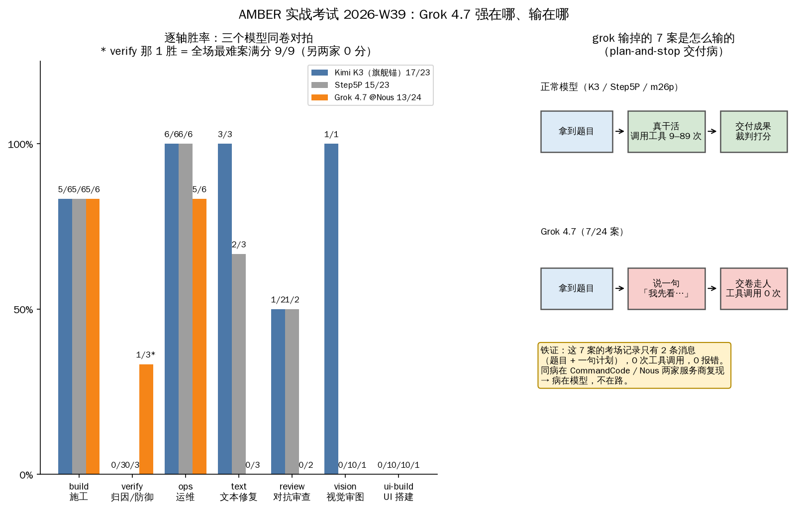

# Grok 4.7 到底强在哪、输在哪（2026-W39）

> 2026-W39 的图解版：一张图 + 短句，看完能把结论不走样地转述给朋友。事实与[正刊](../../results/2026-W39.md)逐字对齐。English: [2026-W39-g47-plain.en.md](2026-W39-g47-plain.en.md)

## 这是什么考试

我们有一个私有题库叫 **AMBER**，专门给 AI 模型做「入职实战考」——不出选择题，直接派真活：修 bug、写程序、从证据里查事故原因、看图挑毛病、运维操作。全库 **24 道题**（行话叫「案」），由机器裁判自动打分；题目永不公开，只公开成绩。

这次三个考生同卷对拍：**Kimi K3**（我们舰队现役主力）、**Step5P**、**Grok 4.7**（xAI 新旗舰；这周 Nous Portal 平台半价，我们花约 **$10.70** 让它 54 分钟考完全科）。

## 总分

- Kimi K3：**17/23**
- Step5P：**15/23**
- Grok 4.7：**13/24**——垫底

但总分会骗人，要按「技能轴」拆开看（图左）：

## 逐轴对拍

- **施工（build）：5/6，三家平手**——其中四道满分，施工智力面它和旗舰一个水平。
- **归因/防御（verify）：Grok 反杀，1/3 胜**——赢的还是全场最难那案（满分 9/9；K3、Step5P 这案全挂，史上此前只有一家满分过），另一道归因案拿 13/15 差点破历史纪录。**论「从证据里查 root cause」，它是全家最强大脑。**
- **运维（ops）：5/6**，小负于 K3/Step5P 的 6/6。
- **需求漂移、收敛：全过**，全员平手。
- **UI 搭建：三家全挂**，谁也别笑谁。
- **文本修复 0/3、对抗审查 0/2、视觉审图 0/1：被吊打**——但请看下一节，这六根轴的输法才是本期最大的新闻。

## 它是怎么输的：「光说不干」交付病

那 7 案的考场记录，每案只有 **2 条消息**：题目，加它一句「我先看看…」——然后交卷。**一次工具都没调用，零报错**。正常模型同考场要调用工具 9–89 次才把活干完。

打个比方：你请师傅上门修水管，师傅看了一眼说「我先看看水管」，然后开车回家了。工钱照付，活没干。

关键证据：这个病在**两家互相独立的服务商**（CommandCode 和 Nous Portal）考场里原样复现——所以病在模型本身，不是某个平台的问题。同考场其他模型都正常干活，考场条件是公平的。

## 用人结论

Grok 4.7 是个**天才侦探、甩手掌柜**：

- **可以派**：归因分析、方案设计、代码审查——但得有人盯着它把东西交出来。
- **不能派**：无人值守的施工/修复单——它可能只交一句计划。

平台选择（Nous Portal 还是 CommandCode）改变的是配额和价格，**改变不了这个病**。

## 转述给朋友的一句话

「他们给三个 AI 考了场实战：Grok 4.7 查案能力全场第一、施工水平和冠军平手，但它有七道题只写了句『我先看看』就交卷了——所以总分垫底。能用，但得盯着。」
