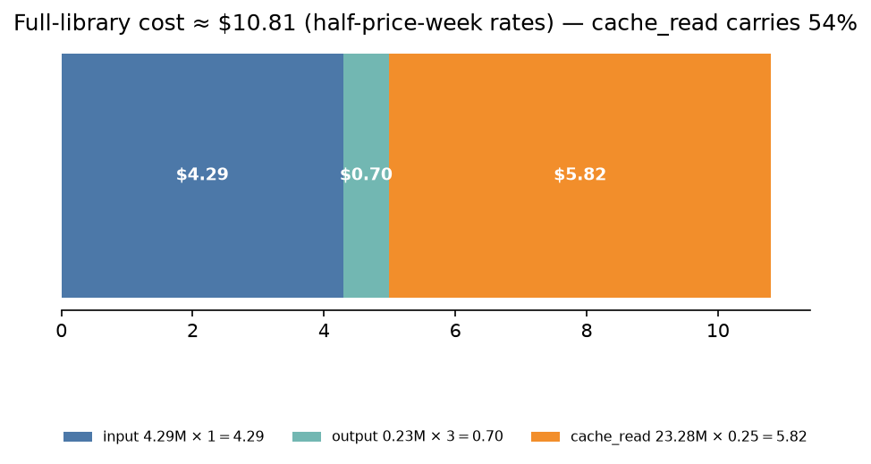
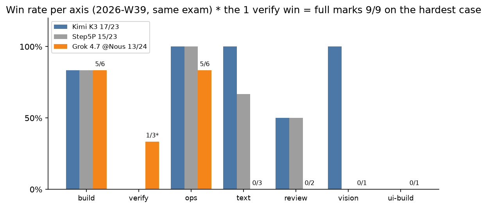

# 2026-W39 — x-ai/grok-4.7 first full-library run (Nous Portal half-price week, day one)

**Summary**: Nous Research announced a one-week half-price window for grok-4.7 on 2026-09-21 ([announcement](https://x.com/NousResearch/status/2102079445607629260)). We ran the full library on day one: 27/27 runs in 54 minutes, score **13/24**, **0 contested**. The headline finding is grok-4.7's "plan-and-stop" delivery failure: 7 cases share the exact same shape — the exam, one sentence of "I'll start by looking at…", **0 tool calls**, and a clean exit. The model states a plan and hands in the paper. The same failure shape appeared the same day on the CommandCode lane with the same model (see [amber-commandcode W39](https://github.com/getaskclaw/amber-commandcode/blob/main/results/2026-W39.md)); two independent providers reproduce it, so the disease is in the model, not in the relay. The strengths are just as real: attribution case A-a317e74b at 13/15 (best-in-history band), build face 5/6, ops face 5/6. Full library real cost **≈$10.7–10.8**, with cache reads carrying half the bill (23.28M × $0.25/M = $5.82).

Short version: [where Grok 4.7 wins, and how it loses](../docs/explainers/2026-W39-g47-plain.en.md).

---

## Run identity

| field | value |
|---|---|
| model | `x-ai/grok-4.7` |
| provider | Nous Portal (inference-api.nousresearch.com, Plus key lane) |
| band | high (effort pass-through verified: reasoning_tokens respond to the dial; legal set on this endpoint is low/medium/high/xhigh) |
| window (UTC) | 2026-09-22 09:38 → 10:32 (54 min elapsed, 2 workers) |
| harness | AMBER agentic harness (Hermes); clean-room bench profile, no fallback chain |
| wire verification | state.db audit: **27/27 scored runs** all (`x-ai/grok-4.7` @ `nousportal`, inference-api.nousresearch.com), zero substitute calls, zero empty sessions |
| case set | AMBER full library v2026-09: **24 cases / 27 runs** (the REQ family is one case with four variants on one bundle); bundle hashes cross-checked against the [amber hash-index](https://github.com/getaskclaw/amber) |
| scoring | required checks only; multi-variant cases must go all-green to pass; 27/27 scored runs valid, zero `invalid_infrastructure` |
| token / cost | input **4.29M** / output **0.23M** / cache_read **23.28M** ≈ **$10.7–10.8** (half-price-week rates: $1/M in, $3/M out, $0.25/M cache_read); matches the owner dashboard spend of $10.70 |
| sanity checks | effort dial live; vision works via data-URI (this endpoint 400s on public-URL images and 1×1 micro-images; the harness embeds base64, unaffected) |

## Full matrix

Case handles are public aliases. The comparison column is the same model on the CommandCode lane the same day (incomplete; full table in [amber-commandcode W39](https://github.com/getaskclaw/amber-commandcode/blob/main/results/2026-W39.md)). Marks: ✓ pass / ✗ fail (d2 score) / ⊘ contested on the comparison lane / — not run there.

| case | face | bundle_sha | **grok-4.7 @ Nous Portal** | grok-4.7 @ CommandCode (ref) |
|---|---|---|---|---|
| A-77d62143 | build(custody) | 7edee286f327 | ✓ 8/8 | ✓ 8/8 |
| A-569dbe0d | build(ETL) | 45ccf06657af | ✓ 10/10 | ✓ 10/10 |
| A-87c472cb | build | cd643fa107e0 | ✗ 6/8 | ✗ 6/8 |
| A-641195e2 | build | 7cc76bad6f89 | ✓ 8/8 | ✓ 8/8 |
| A-442d4aab | build | ddf28dfda1cd | ✓ 7/7 | ✓ 7/7 |
| A-61f7ad01 | build(UI) | 991167b1455f | ✓ 7/7 | ✗ 5/7 |
| A-d511f9e8 | verify | f725082a2dc8 | ✗ 4/12 | ◍ invalid |
| A-a317e74b | verify | e05970e7d7c9 | ✗ 13/15 | ✗ 14/15 |
| A-be92627f | verify | 6593829abdfa | ✓ 9/9 | ✓ 9/9 |
| A-cdc3d11a | review | dbb207a3118d | ✗ -2 (plan-and-stop) | ⊘ contested |
| A-47eea242 | review | b4b8d4bb44e3 | ✗ -2 (plan-and-stop) | ⊘ contested |
| A-ea80d793 | vision | 1d69841b029e | ✗ -2 (plan-and-stop) | ⊘ contested |
| A-791e90ac | text | 0396c8576a56 | ✗ no code block (plan-and-stop) | ⊘ contested |
| A-1fd3683a | text | 6a980035b42f | ✗ no code block (plan-and-stop) | ⊘ contested |
| A-13854d9d | text | a56b202b0537 | ✗ no code block (plan-and-stop) | ⊘ contested |
| A-d9b79b46 | ui-build | d6d63130ecc6 | ✗ (plan-and-stop) | — not run |
| A-0676097b | req-drift | 3c04bb80fe94 | ✓ 4/4 | — not run |
| A-a5608487 | ops | bcfac8de9f29 | ✓ | ✓ |
| A-984e80ee | ops | a28b57d4d1f1 | ✗ | ⊘ contested |
| A-24bcf707 | ops | ba4431d40006 | ✓ | ◍ invalid |
| A-8d4bc770 | ops | bcfb57e27cff | ✓ | — not run |
| A-6fbeb363 | ops | 53623441d653 | ✓ | — not run |
| A-8c909d0a | ops | 0e90d37d4f1e | ✓ | — not run |
| A-3f2a9cdd | convergence | 4880adbea261 | ✓ | — not run |
| **total** | | | **13/24** | incomplete (6 pass 3 fail 7⊘ 2◍ 6—) |

## Findings

1. **"Plan-and-stop" delivery failure, proven across two providers.** 7 cases (A-791e90ac / A-1fd3683a / A-13854d9d / A-cdc3d11a / A-47eea242 / A-ea80d793 / A-d9b79b46) share one transcript shape: the exam, one sentence of "I'll start by looking at…", **0 tool calls**, clean cli_close. In single-task mode the first text reply is the final answer, and the model chooses to output only a plan. This lane saw zero 4xx, a smoothly draining balance, and a silent watchdog (no quota wall); the CommandCode lane produced the same shape → model nature, not the relay. Under the same harness, this week's comparison models (mimo-v2.6-pro and others) deliver normally, so the conditions were fair.
2. **Cut-off checks: 0 contested.** All 27 sessions end with cli_close and zero 4xx; the 7 low-token failures (1–2 calls each) were convicted case by case from transcripts as delivery failure, not infrastructure. Method: token checks only point at suspects; transcripts decide.
3. **Root-cause work in the top band.** A-a317e74b at 13/15 (CommandCode same case 14/15; best-in-history band 14/15) — the high-reasoning face is real. Passing still requires all pins, so it counts as a fail.
4. **A-87c472cb scores 6/8 on four lanes** (this lane, CommandCode ×2, m26p) — everyone falls in the same pit (the ±8h boundary family of old traps). Case-level problem suspected.
5. **A-d511f9e8 really ran here: 4/12.** The same case went invalid_infrastructure on both CommandCode lanes (1800s cap). This lane proves the case can be tested — the problem sits in the cc lane's infrastructure, not in the case.
6. **Transparent cost accounting.** The full library cost $10.7 for 54 minutes; cache_read 23.28M × $0.25/M = $5.82 is half the bill. Budget a pay-as-you-go lane as "in + 0.25×cache_read" — counting only fresh input under-estimates by half.

## Harness notes

- Multi-variant cases (A-0676097b, 4 runs sharing one bundle) count as one case and must go all-green: this case went 4/4.
- Exam discipline: clean-room profile (profile-embedded nousportal provider plugin = an API-key mirror of the bundled nous OAuth lane), no fallback chain, at most 2 concurrent runs, $12 cost breaker (real token×price math — state.db does not price nousportal; the first breaker formula idled and was fixed).
- Publication rules: transcripts, oracles, and candidate workspaces are never published; the delivery failure is described only by overall stats and message counts (2 messages / 0 tool calls), never by quoting question content.

## Verdict

grok-4.7 @ Nous Portal: top-band high-reasoning face (root-cause 13/15, build 5/6, ops 5/6, req-drift 4/4, convergence pass), but a hard **agentic delivery-reliability** flaw — 7/24 cases where it talks and does not work, proven as model nature across two providers. **Do not** hand it unattended build or repair jobs. **Do** hand it supervised one-shot Q&A, planning, and attribution analysis. The choice of lane (Nous Portal vs CommandCode) changes quota and price, not this disease.
