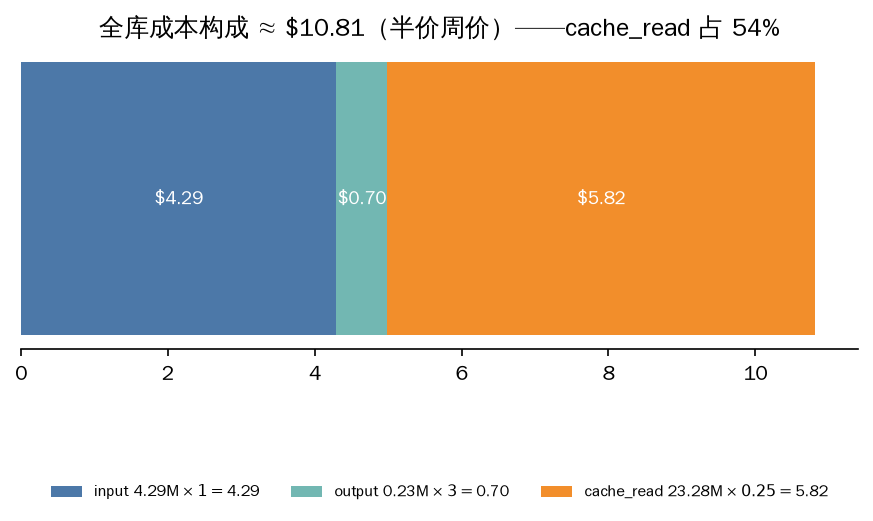
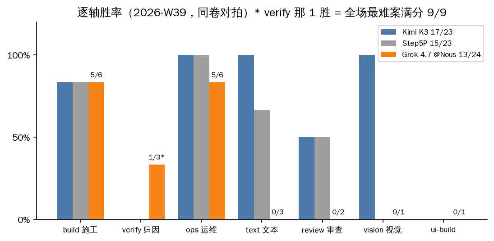

# 2026-W39 — x-ai/grok-4.7 全库首考（Nous Portal 半价周首日）

**中文摘要**：Nous Research 2026-09-21 官宣 grok-4.7 半价一周（[公告](https://x.com/NousResearch/status/2102079445607629260)），本仓首日全库首考：54 分钟 27/27 卷一次过，成绩 **13/24**，**0 冤案**。最大发现是 grok-4.7 的「plan-and-stop」交付病：7 案同一死法——考生卷 + 一句「我先看…」计划 + **0 次工具调用** + 干净收场，模型说完计划就交卷。同日 CommandCode 道同模型废卷同型（该道成绩见 [amber-commandcode W39](https://github.com/getaskclaw/amber-commandcode/blob/main/results/2026-W39.md)），双 provider 互证=模型本性，与转发层无关。亮点同样真实：归因钉 A-a317e74b 拿 13/15（历史最佳带）、施工 BD 面 5/6、OPS 面 5/6。全库实价 **≈$10.7–10.8**，其中 cache_read 占半壁江山（23.28M × $0.25/M = $5.82）。

---

图解版：[Grok 4.7 到底强在哪、输在哪](../docs/explainers/2026-W39-g47-plain.md)。English: [2026-W39.en.md](2026-W39.en.md)

## Run identity

| field | value |
|---|---|
| model | `x-ai/grok-4.7` |
| provider | Nous Portal（inference-api.nousresearch.com，Plus key 道） |
| band | high（reasoning effort 透传实证：reasoning_tokens 随档响应；该端点合法集 low/medium/high/xhigh） |
| window (UTC) | 2026-09-22 09:38 → 10:32（54 min elapsed，双并发） |
| harness | AMBER agentic harness（Hermes）；净室 bench profile，无 fallback 链 |
| wire verification | state.db audit：**27/27 计分卷**全为（`x-ai/grok-4.7` @ `nousportal`，inference-api.nousresearch.com），零替身调用、零空会话 |
| case set | AMBER full library v2026-09：**24 案 / 27 卷**全考（REQ 系一案四变体同 bundle）；bundle 哈希对照 [amber hash-index](https://github.com/getaskclaw/amber) |
| scoring | required checks only；多变体案须全变体绿才算过；27/27 计分卷 valid，零 `invalid_infrastructure` |
| token / cost | input **4.29M** / output **0.23M** / cache_read **23.28M** ≈ **$10.7–10.8**（半价周价：$1/M in、$3/M out、$0.25/M cache_read）；owner 面板 spend $10.70 对账闭环 |
| 校准 | effort 旋钮在线；视觉 data-URI 通（该端点公网 URL 图与 1×1 微图 400，harness 内嵌 base64 不受影响） |

## Full matrix

Case handles 为公开别名。对照列 = 同日 CommandCode 道同模型（未完赛，全表见 [amber-commandcode W39](https://github.com/getaskclaw/amber-commandcode/blob/main/results/2026-W39.md)）。标记：✓ 过 / ✗ 挂（d2 分）/ ⊘ 对照道 contested / — 对照道未考。

| case | face | bundle_sha | **grok-4.7 @ Nous Portal** | grok-4.7 @ CommandCode（对照） |
|---|---|---|---|---|
| A-77d62143 | build(custody) | 7edee286f327 | ✓ 8/8 | ✓ 8/8 |
| A-569dbe0d | build(ETL) | 45ccf06657af | ✓ 10/10 | ✓ 10/10 |
| A-87c472cb | build | cd643fa107e0 | ✗ 6/8 | ✗ 6/8 |
| A-641195e2 | build | 7cc76bad6f89 | ✓ 8/8 | ✓ 8/8 |
| A-442d4aab | build | ddf28dfda1cd | ✓ 7/7 | ✓ 7/7 |
| A-61f7ad01 | build(UI) | 991167b1455f | ✓ 7/7 | ✗ 5/7 |
| A-d511f9e8 | verify | f725082a2dc8 | ✗ 4/12 | ◍ invalid |
| A-a317e74b | verify | e05970e7d7c9 | ✗ 13/15 | ✗ 14/15 |
| A-be92627f | verify | 6593829abdfa | ✓ 9/9 | ✓ 9/9 |
| A-cdc3d11a | review | dbb207a3118d | ✗ -2（plan-and-stop） | ⊘ contested |
| A-47eea242 | review | b4b8d4bb44e3 | ✗ -2（plan-and-stop） | ⊘ contested |
| A-ea80d793 | vision | 1d69841b029e | ✗ -2（plan-and-stop） | ⊘ contested |
| A-791e90ac | text | 0396c8576a56 | ✗ no code block（plan-and-stop） | ⊘ contested |
| A-1fd3683a | text | 6a980035b42f | ✗ no code block（plan-and-stop） | ⊘ contested |
| A-13854d9d | text | a56b202b0537 | ✗ no code block（plan-and-stop） | ⊘ contested |
| A-d9b79b46 | ui-build | d6d63130ecc6 | ✗（plan-and-stop） | — 未考 |
| A-0676097b | req-drift | 3c04bb80fe94 | ✓ 4/4 | — 未考 |
| A-a5608487 | ops | bcfac8de9f29 | ✓ | ✓ |
| A-984e80ee | ops | a28b57d4d1f1 | ✗ | ⊘ contested |
| A-24bcf707 | ops | ba4431d40006 | ✓ | ◍ invalid |
| A-8d4bc770 | ops | 957f29e633c7 | ✓ | — 未考 |
| A-6fbeb363 | ops | bcfb57e27cff | ✓ | — 未考 |
| A-8c909d0a | ops | 53623441d653 | ✓ | — 未考 |
| A-3f2a9cdd | convergence | 4880adbea261 | ✓ | — 未考 |
| **total** | | | **13/24** | 未完赛（6 胜 3 负 7⊘ 2◍ 6—） |

## Findings

1. **「plan-and-stop」交付病，双 provider 互证。** 7 案（A-791e90ac/A-1fd3683a/A-13854d9d/A-cdc3d11a/A-47eea242/A-ea80d793/A-d9b79b46）transcript 同一形态：考生卷 + 一句「我先看…」计划 + **0 次工具调用** + 干净 cli_close——单科卷模式下「首条文本即终答」，模型选择只输出计划。本道全程零 4xx、余额平滑、哨兵静默（无墙环境）；CommandCode 道同案废卷同型 → 模型本性，与转发层无关。同 harness 同条件下本周对照模型（mimo-v2.6-pro 等）均能交付，考场条件公平。
2. **截尾法医 0 冤案。** 全部 27 会话 end_reason=cli_close、零 4xx；7 个低 token 失败卷（1–2 次调用）逐卷 transcript 定罪为交付病，非基建害死。方法：token 法医只提名、transcript 定罪。
3. **归因钉进第一档。** A-a317e74b 拿 13/15（CommandCode 道同案 14/15，历史最佳带 14/15）——高推理面确有料；过线要全钉，仍计挂。
4. **A-87c472cb 四道同分 6/8**（本道、CommandCode×2、m26p）——全员同坑不粉饰（±8h 边界同族老坑），案级问题嫌疑。
5. **A-d511f9e8 真跑 4/12**：同案在 CommandCode 双道 invalid_infrastructure（1800s cap 撞顶），本道证明案可考——问题在 cc 道基建，不在案。
6. **成本透明账。** 全库 $10.7 换 54 分钟；cache_read 23.28M × $0.25/M = $5.82 占半壁江山——按量道预算须按「in + 0.25×cache_read」建模，只算 fresh input 会低估一倍。

## Harness notes

- 多变体案（A-0676097b，4 卷共享 bundle）按单案计，须全变体绿：本案 4/4 全绿。
- 考场纪律：净室 profile（profile 内嵌 nousportal provider 插件 = bundled nous OAuth 道的 API-key 镜像），无 fallback 链；每场至多 2 并发；成本断路器 $12（token×单价实算——state.db 不记 nousportal 价，首版断路器空转已修复）。
- 发布纪律：transcript/oracle/考生工作区不公开；交付病形态仅以聚合统计与消息计数（2 messages / 0 tool calls）描述，不引用题目内容。

## Verdict

grok-4.7 @ Nous Portal：高推理面一档（归因钉 13/15、施工 BD 面 5/6、OPS 面 5/6、需求漂移 4/4、收敛案过），但 **agentic 交付可靠性硬伤**——7/24 案光说不干，双 provider 互证为模型本性。**不可派**无人值守施工/修复单；**可派**有人盯交付的一次性问答、方案、归因分析。道的选择（Nous Portal vs CommandCode）影响配额与价格，不影响这个病。
