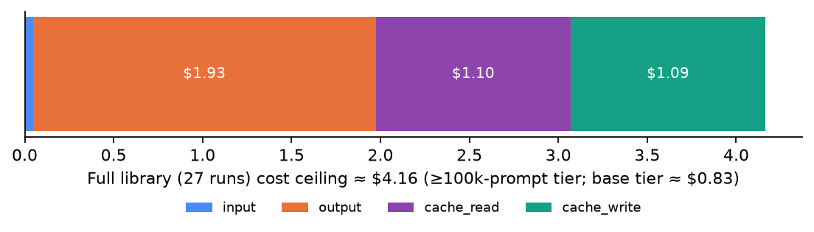
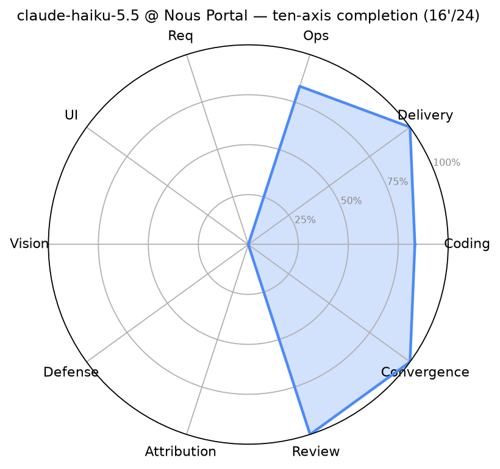

# 2026-W41 — anthropic/claude-haiku-5.5 and laguna-s-2.1 full-library first runs (Nous Portal)

**Summary**: Claude Haiku 5.5 (Anthropic's small, fast model) ran the full AMBER library on the Nous Portal lane: **27/27 runs in about 38 minutes, score 16'/24** (16 pass · 6 fail · 2 cases held and not counted: defense A-d511f9e8 held on every lane; ops A-24bcf707 see the 10-09 update below), **0 contested runs**, total cost ceiling **≈$4.2** (base tier just $0.83) — 1/13 to 1/3 of this repo's grok-4.7 first-run bill ($10.7), with 5 more wins (grok-4.7 corrected: 11 pass). The build face is remarkably strong: 5 of 6 BD cases won, all five with perfect pin scores, 5 of 6 OPS cases won, and the convergence case passed all three pins. The ceiling is just as clear: none of the three deep-analysis (BE) cases passed (1 held, 2 real fails), visual defect-hunting hit only 2/5, and the brand-page UI case missed one pin out of twelve (title clipping at 1280px). Same-issue correction: two W39 grok-4.7 rows (A-be92627f, A-a5608487) are voided per adjudication ADJ-20261002, moving W39 from 13/24 to **11'/24** — see the erratum section at the end.

> ' apostrophe = some cases held/void and not counted. This issue's hold is a case-level harness hold (A-d511f9e8, held for all lanes since 2026-10-02), not a model dispute.

> **Update 2026-10-09**: claude-haiku-5.5's ops case A-24bcf707 changes from ✗ 4/5 to ◍ held (NA), not counted as a win or a loss. Basis: the [2026-10-07 correction (A-24bcf707)](https://github.com/getaskclaw/amber/blob/main/docs/corrections-2026-10-07-a-24bcf707.en.md) describes a grader defect. The only required check that failed on this paper is `removal_found` (the diff of the named removal commit has no deleted lines in the feature files), the same pattern. That correction was signed for seven lanes; this lane is treated the same way by the owner's ruling of 2026-10-09, and the spec's 10-07 table is unchanged. The total changes from 16'/24 (16 pass · 7 fail · 1 held) to **16'/24 (16 pass · 6 fail · 2 held)**: the pass count is unchanged, the ops axis reads 5/6 (incl. 1 fail) → 5/6 · 1 NA, and the composition chart is redrawn. Also, the internal case numbers in the W39 erratum and the review note were replaced by public aliases; wording only, no verdict changed. The rest of the text is unchanged.

**Another model on the same gateway**: laguna-s-2.1 (free tier, high band) sat the full library once via Nous Portal: 27 papers across 24 cases; 19 passed as valid, 4 failed as valid, and 4 were voided for infrastructure reasons at the exam room (not counted against the candidate). The board shows **16'/24** (16 pass · 3 fail · 5 NA); the NAs include 2 cases held on every lane. The same model was also sat on the CommandCode route, see the [CommandCode W41 page](https://github.com/getaskclaw/amber-commandcode/blob/main/results/2026-W41.en.md).

---

Chinese: [2026-W41.md](2026-W41.md)

## Run identity

| field | value |
|---|---|
| model | `anthropic/claude-haiku-5.5` |
| provider | Nous Portal (inference-api.nousresearch.com, Plus key lane) |
| band | high (reasoning effort passthrough) |
| window (UTC) | 2026-10-08 00:25 → 01:03 (~38 min elapsed, 2 workers) |
| harness | AMBER agentic harness (Hermes); clean-room bench profile, no fallback chain |
| wire verification | state.db audit: **27/27 scored runs** all (`anthropic/claude-haiku-5.5` @ `nousportal`), zero stand-in calls, zero empty sessions |
| case set | AMBER full library v2026-09: **24 cases / 27 runs** (the REQ case is one case in four variants sharing a bundle); bundle hashes cross-checked against the [amber hash-index](https://github.com/getaskclaw/amber) |
| scoring | required checks only; a multi-variant case passes only if every variant is green; 27/27 scored runs valid, zero `invalid_infrastructure` |
| token / cost | input **95K** / output **771K** / cache_read **21.9M** / cache_write **1.75M**; ceiling at the ≥100k-prompt tier **≈$4.16**, base tier **≈$0.83** |
| calibration | raw API PONG 200 (model echo matches); clean-room profile PONG + state.db wire audit (billing_provider=nousportal); native vision text+image→text, so the vision case ran as designed |

| field | value (laguna-s-2.1) |
|---|---|
| model | `poolside/laguna-s-2.1:free` (the score database records provider `nousportal`) |
| band | high |
| first paper start (UTC) | 2026-10-09 00:39 |
| terminal states of the 27 papers | 19 valid pass · 4 valid fail · 4 voided for infrastructure at the exam room |
| usage (46 usage records) | input 2,910,291 · output 454,617 · cache read 9,595,552 · cache write 0 (2 of the 46 records carry no provider tag; included in the totals) |

## Full matrix

Case handles are public aliases. The two columns are two models on the same gateway (claude-haiku-5.5 and laguna-s-2.1), on one case set. Marks: ✓ pass / ✗ fail (d2 score) / ⊘ NA (held or void, not counted). The grok-4.7 comparison column is no longer repeated here; see the [W39 page](2026-W39.en.md).

<!-- matrix:start -->

Cases are listed by public alias; check them against the [amber hash-index](https://github.com/getaskclaw/amber). ✓ pass · ✗ fail · ⊘ NA (void or held, not counted). Scores are required checks passed/total; the review and vision axes use a fault-finding score, which can be negative. Rows follow the ten-axis order.

| case | axis | bundle_sha | claude-haiku-5.5 | laguna-s-2.1 (Nous Portal) |
|---|---|---|---|---|
| A-77d62143 | Coding | 7edee286f327 | ✓ 8/8 | ✓ 8/8 |
| A-569dbe0d | Coding | 45ccf06657af | ✓ 10/10 | ✓ 10/10 |
| A-87c472cb | Coding | cd643fa107e0 | ✗ 6/8 | ⊘ NA (invalid) |
| A-641195e2 | Coding | 7cc76bad6f89 | ✓ 8/8 | ✓ 8/8 |
| A-442d4aab | Coding | ddf28dfda1cd | ✓ 7/7 | ✗ 1/7 |
| A-61f7ad01 | Coding | 991167b1455f | ✓ 7/7 | ✓ 7/7 |
| A-791e90ac | Delivery | 0396c8576a56 | ✓ 6/6 | ✓ 6/6 |
| A-1fd3683a | Delivery | 6a980035b42f | ✓ 2/2 | ✓ 2/2 |
| A-13854d9d | Delivery | a56b202b0537 | ✓ 5/5 | ✓ 5/5 |
| A-a5608487 | Ops | bcfac8de9f29 | ✓ 5/5 | ✓ 5/5 |
| A-984e80ee | Ops | a28b57d4d1f1 | ✓ 5/5 | ✓ 5/5 |
| A-24bcf707 | Ops | ba4431d40006 | ⊘ NA (held, re-sit pending) | ✓ 5/5 |
| A-8d4bc770 | Ops | 957f29e633c7 | ✓ 5/5 | ✓ 5/5 |
| A-6fbeb363 | Ops | bcfb57e27cff | ✓ 6/6 | ✓ 6/6 |
| A-8c909d0a | Ops | 53623441d653 | ✓ 7/7 | ✓ 7/7 |
| A-0676097b | Requirements | 3c04bb80fe94 | ✗ 3/4 variants | ✓ 4/4 variants |
| A-3f2a9cdd | Convergence | 4880adbea261 | ✓ | ✓ |
| A-d9b79b46 | UI | e33e48797990 | ✗ 11/12 | ✗ 11/12 |
| A-ea80d793 | Vision | 1d69841b029e | ✗ fault-finding −1 | ✗ fault-finding −2 |
| A-d511f9e8 | Defense | f725082a2dc8 | ⊘ NA (held, re-sit pending) | ⊘ NA (held, re-sit pending) |
| A-be92627f | Defense | 6593829abdfa | ✗ 4/9 | ⊘ NA (invalid) |
| A-a317e74b | Attribution | e05970e7d7c9 | ✗ 10/15 | ⊘ NA (invalid) |
| A-cdc3d11a | Review | dbb207a3118d | ✓ fault-finding 1 | ⊘ NA (held, re-sit pending) |
| A-47eea242 | Review | b4b8d4bb44e3 | ✓ fault-finding 3 | ✓ fault-finding 4 |
| **total** | | | **16/24 wins · 6 losses · 2 NA** | **16/24 wins · 3 losses · 5 NA** |

<!-- matrix:end -->

## Ten axes

<!-- axes:start -->

| group | axis | claude-haiku-5.5 · passes | claude-haiku-5.5 · completion | laguna-s-2.1 (Nous Portal) · passes | laguna-s-2.1 (Nous Portal) · completion |
|---|---|:-:|:-:|:-:|:-:|
| Building | Coding | 5/6 | 0.96 | 4/6 · 1 NA | 0.83 |
|  | Delivery | 3/3 | 1.00 | 3/3 | 1.00 |
|  | Ops | 5/6 · 1 NA | 1.00 | 6/6 | 1.00 |
|  | Requirements | 0/1 | 0.75 | 1/1 | 1.00 |
|  | Convergence | 1/1 | 1.00 | 1/1 | 1.00 |
| Judging | UI | 0/1 | 0.92 | 0/1 | 0.92 |
|  | Vision | 0/1 | 0.33 | 0/1 | 0.22 |
|  | Defense | 0/2 · 1 NA | 0.44 | 0/2 · 2 NA | — |
|  | Attribution | 0/1 | 0.67 | 0/1 · 1 NA | — |
|  | Review | 2/2 | 0.67 | 1/2 · 1 NA | 0.89 |
| | **total** | **16'/24** |  | **16'/24** |  |

Two readings of the same papers. **Passes** = cases passed / cases on the axis; a case passes only when every required check passes. This is the [askclaw.dev](https://askclaw.dev/en/rank/) board metric. **Completion** = 0–1, prorated by required checks, so a failed case still earns the share it got right; review and vision are prorated from the fault-finding score. NA cases count in neither. Most axes hold one or two cases, so one case can move the reading.

<!-- axes:end -->

The radar covers claude-haiku-5.5 only (not redrawn in this change).

## Findings

1. **A price-performance break.** A $0.83–4.16 full-library bill (conservative ceiling at the higher tier) buys 16 wins; this repo's grok-4.7 first run cost $10.7 for 13 wins (corrected: 11). The bill itself differs 2.6–13× ($10.7 vs $0.83–4.16).
2. **High perfect-pin rate on the build face.** 5 of 6 BD cases won, all five with perfect pin scores (8/8, 10/10, 8/8, 7/7, 7/7); 5 of 6 OPS cases won, all five with perfect scores (5/5, 5/5, 5/5, 6/6, 7/7); the sixth case A-24bcf707 is held (see the 10-09 update). On "implement the spec" and "follow the runbook" work, the small model does not blink.
3. **Deep analysis is the ceiling.** None of the three BE cases passed (1 held; 2 real fails: 10/15 and 4/9) — long-chain attribution/defense analysis clearly trails its sibling opus-5.5 (W39 first run, 17'/24).
4. **Both review verdicts correct.** A-cdc3d11a called FIX correctly (2/3 hits, 1 false positive), A-47eea242 called SHIP correctly (0 false positives) — verdict direction is perfect; pin-level precision is middling.
5. **REQ breaks on leaf-swap.** 3 of 4 requirement-drift variants pass (visible/drift/signed-sync all 100; leaf-swap 50) — the leaf-node swap type of drift slipped through.
6. **Zero infrastructure incidents.** All 27 sessions closed cleanly (cli_close), zero 4xx, zero rate limiting; truncation forensics found 0 contested runs — every low score is a real failure (the two BE losses made 52–64 API calls each and ran their full course).

5. **Five cases differ between the two routes of laguna-s-2.1**: A-442d4aab (Nous fail · CommandCode pass), A-1fd3683a (Nous pass · CommandCode fail), A-0676097b (Nous pass · CommandCode fail), A-61f7ad01 (Nous pass · CommandCode voided for infrastructure), A-be92627f (Nous voided for infrastructure · CommandCode fail). The two routes report different upstream version information (see the disclosure on the CommandCode page), so this page makes no same-source ruling.

## Harness notes

- Multi-variant case (A-0676097b, 4 runs sharing one bundle) counts as one case and must be all-green: 3/4 here, counted as fail.
- A-d511f9e8 (A-d511f9e8) has been on a case-level hold for all lanes since 2026-10-02 (three harness defects: file-pickup rule, prompt text, and scoring attribution; full re-run after repair). This row records NA(held); the raw 4/12 is kept on file but not counted.
- Lane discipline: clean-room profile (in-profile nousportal provider plugin), no fallback chain, at most 2 concurrent runs, cost circuit breaker $10 (token × unit price, v6.1 style).
- Publication discipline: transcripts, oracles, and candidate workspaces are not published.

## Erratum: two W39 grok-4.7 cases voided

Per adjudication ADJ-20261002-integrity-2 (integrity review step 2): in runs-np-g47-high-20260922, **A-be92627f (originally ✓ 9/9) and A-a5608487 (originally ✓)** touched answer-level material during the attempt and are re-recorded as `void_integrity` (void, NA, not counted, denominator unchanged). The W39 score is corrected from 13/24 to **11'/24** (11 pass · 10 fail · 3 NA: 2 void + 1 case-level hold). The original W39 issue text is preserved; this section is authoritative.

## Verdict

claude-haiku-5.5 @ Nous Portal: **assignable** to short-chain build/ops work (the BD/OPS perfect-pin rate says it can hold it), and the first pick for cost-sensitive standby duty; **not assignable** to deep-analysis (BE) work or precision visual defect-hunting. With a 1M context and $0.1/M input, it is a serious contender in the "cheap, but must finish the job" bracket.
