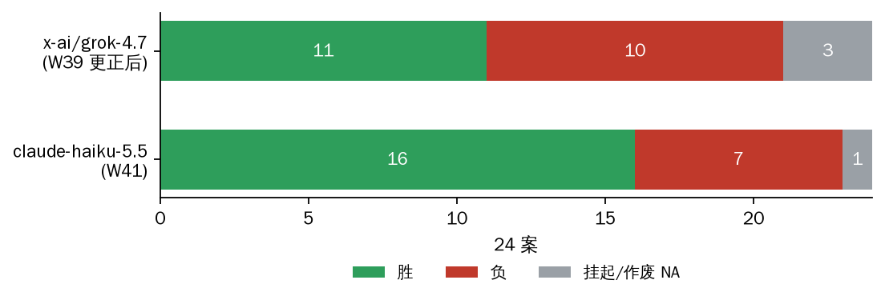
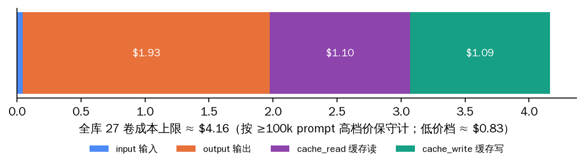
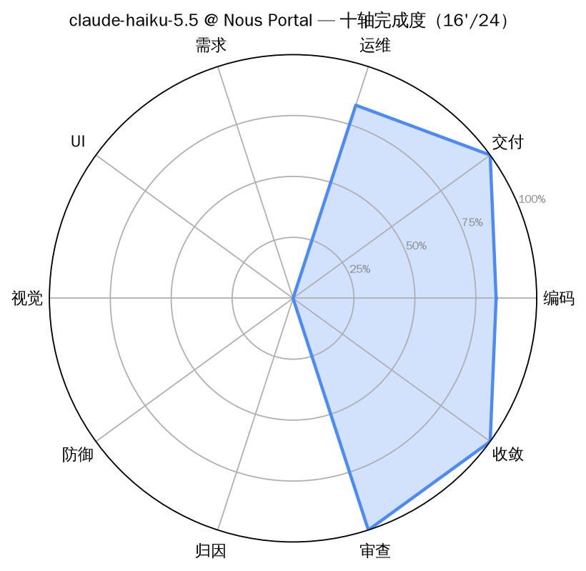

# 2026-W41 — anthropic/claude-haiku-5.5 全库首考（Nous Portal）

**中文摘要**：Claude Haiku 5.5（Anthropic 的小杯快模型）在 Nous Portal 道上全库首考：**约 38 分钟 27/27 卷一次过，成绩 16'/24**（16 胜 · 7 负 · 1 案全车道挂起不计胜负），**0 冤案**，全库成本上限 **≈$4.2**（低价档仅 $0.83）——为同仓 grok-4.7 首考账单（$10.7）的 1/13 ~ 1/3，成绩还多赢 5 案（grok-4.7 更正后 11 胜）。施工面尤其硬：BD 六案 5 胜且全满钉、OPS 六案 5 胜、收敛案三钉全过。天花板同样清楚：深度分析三案（BE 系）无一过线（1 案挂起、2 案真负）、视觉找茬 2/5、JJA 品牌页 11/12 差一钉（1280px 标题裁切）。同期更正：W39 grok-4.7 两行（BE-003、OPS-01）按终审裁定 ADJ-20261002 改记作废（NA），成绩由 13/24 更正为 **11'/24**，详见文末更正节。

> ' 撇号 = 有挂起/作废案不计胜负。本期的挂起是案级考场挂起（A-d511f9e8，2026-10-02 起全车道统一挂起），不是模型争议。

---

图解版：待补。English: [2026-W41.en.md](2026-W41.en.md)

## Run identity

| field | value |
|---|---|
| model | `anthropic/claude-haiku-5.5` |
| provider | Nous Portal（inference-api.nousresearch.com，Plus key 道） |
| band | high（reasoning effort 透传） |
| window (UTC) | 2026-10-08 00:25 → 01:03（约 38 min elapsed，双并发） |
| harness | AMBER agentic harness（Hermes）；净室 bench profile，无 fallback 链 |
| wire verification | state.db audit：**27/27 计分卷**全为（`anthropic/claude-haiku-5.5` @ `nousportal`），零替身调用、零空会话 |
| case set | AMBER full library v2026-09：**24 案 / 27 卷**全考（REQ 系一案四变体同 bundle）；bundle 哈希对照 [amber hash-index](https://github.com/getaskclaw/amber) |
| scoring | required checks only；多变体案须全变体绿才算过；27/27 计分卷 valid，零 `invalid_infrastructure` |
| token / cost | input **95K** / output **771K** / cache_read **21.9M** / cache_write **1.75M**；按 ≥100k prompt 高档价保守计上限 **≈$4.16**，低价档 **≈$0.83** |
| 校准 | 裸 API PONG 200（model 回显一致）；净室 profile PONG + state.db 验脑（billing_provider=nousportal）；原生视觉 text+image→text，视觉案照考 |

## Full matrix

Case handles 为公开别名。对照列 = 同仓 W39 的 grok-4.7 @ Nous Portal（已按 ADJ-20261002 更正：BE-003、OPS-01 作废 NA，见文末更正节）。标记：✓ 过 / ✗ 挂（d2 分）/ ◍ 挂起不计胜负。

| case | face | bundle_sha | **claude-haiku-5.5 @ Nous Portal** | grok-4.7 @ Nous Portal（对照，已更正） |
|---|---|---|---|---|
| A-77d62143 | build(custody) | 7edee286f327 | ✓ 8/8 | ✓ 8/8 |
| A-569dbe0d | build(ETL) | 45ccf06657af | ✓ 10/10 | ✓ 10/10 |
| A-87c472cb | build | cd643fa107e0 | ✗ 6/8 | ✗ 6/8 |
| A-641195e2 | build | 7cc76bad6f89 | ✓ 8/8 | ✓ 8/8 |
| A-442d4aab | build | ddf28dfda1cd | ✓ 7/7 | ✓ 7/7 |
| A-61f7ad01 | build(UI) | 991167b1455f | ✓ 7/7 | ✓ 7/7 |
| A-d511f9e8 | verify | f725082a2dc8 | ◍ 案级挂起（原始 4/12） | ◍ 案级挂起（原始 4/12） |
| A-a317e74b | verify | e05970e7d7c9 | ✗ 10/15 | ✗ 13/15 |
| A-be92627f | verify | 6593829abdfa | ✗ 4/9 | ~~✓ 9/9~~ 作废 NA（考卷越界） |
| A-cdc3d11a | review | dbb207a3118d | ✓ d2=1.0（verdict FIX 判对，hits 2/3，fp=1） | ✗ -2（plan-and-stop） |
| A-47eea242 | review | b4b8d4bb44e3 | ✓ d2=3（verdict SHIP 判对，fp=0） | ✗ -2（plan-and-stop） |
| A-ea80d793 | vision | 1d69841b029e | ✗ d2=-1.0（hits 2/5，fp=0） | ✗ -2（plan-and-stop） |
| A-791e90ac | text | 0396c8576a56 | ✓ 6/6 | ✗ no code block |
| A-1fd3683a | text | 6a980035b42f | ✓ 2/2 | ✗ no code block |
| A-13854d9d | text | a56b202b0537 | ✓ 5/5 | ✗ no code block |
| A-d9b79b46 | ui-build | e33e48797990 ¹ | ✗ 11/12（1280px 标题裁切一钉挂） | ✗（plan-and-stop） |
| A-0676097b | req-drift | 3c04bb80fe94 | ✗ 3/4 变体（leaf-swap 50 分挂） | ✓ 4/4 |
| A-a5608487 | ops | bcfac8de9f29 | ✓ 5/5 | ~~✓~~ 作废 NA（考卷越界） |
| A-984e80ee | ops | a28b57d4d1f1 | ✓ 5/5 | ✗ |
| A-24bcf707 | ops | ba4431d40006 | ✗ 4/5 | ✓ |
| A-8d4bc770 | ops | 957f29e633c7 | ✓ 5/5 | ✓ |
| A-6fbeb363 | ops | bcfb57e27cff | ✓ 6/6 | ✓ |
| A-8c909d0a | ops | 53623441d653 | ✓ 7/7 | ✓ |
| A-3f2a9cdd | convergence | 4880adbea261 | ✓ 三钉全过 | ✓ |
| **total** | | | **16'/24**（16 胜 · 7 负 · 1 挂起） | **11'/24**（11 胜 · 10 负 · 3 NA） |

¹ 本案 bundle 与 W39 期不同（W39 为 d6d63130ecc6）：案间考场已重建，跨期不直接比 d2 细目，胜负口径仍一致。

## Findings

1. **性价比断层。** $0.83–4.16 全库账单（高价档保守上限）换 16 胜；同仓 grok-4.7 首考 $10.7 换 13 胜（更正后 11 胜）。账单差 2.6–13 倍（$10.7 vs $0.83–4.16）。
2. **施工面满钉率高。** BD 六案 5 胜且 5 胜全满钉（8/8、10/10、8/8、7/7、7/7）；OPS 六案 5 胜且 5 胜全满钉（5/5、5/5、5/5、6/6、7/7）。小模型在「照需求把功能写对」「照规程干脏活」两面完全不虚。
3. **深分析是天花板。** BE 系三案无一过线（1 案挂起，2 案真负：10/15、4/9）——长链条归因/防御分析明显弱于同族 opus-5.5（W39 首考 17'/24）。
4. **审查案双对。** BD-R001 判 FIX 正确（hits 2/3，1 误报）、BD-R003 判 SHIP 正确（0 误报）——verdict 方向感满分，找钉精度中等。
5. **REQ 系折在 leaf-swap。** 需求漂移四变体 3 过 1 挂（visible/drift/signed-sync 均 100 分，leaf-swap 50 分）——叶节点偷换型漂移没抓住。
6. **零基建事故。** 全部 27 会话干净收场（cli_close）、零 4xx、零限流；截尾法医 0 冤案，低分卷均为真打真负（BE 两案各 52–64 次 API 调用，跑满全程）。

## Harness notes

- 多变体案（A-0676097b，4 卷共享 bundle）按单案计，须全变体绿：本案 3/4，计负。
- A-d511f9e8（BE-001）自 2026-10-02 起全车道案级挂起（考场取件规则+题面+判分归因三重缺陷，待修后全体重考），本行照规则记 NA(held)，原始分 4/12 仅留档不计胜负。
- 考场纪律：净室 profile（profile 内嵌 nousportal provider 插件），无 fallback 链；每场至多 2 并发；成本断路器 $10（token×单价实算，v6.1 式）。
- 发布纪律：transcript/oracle/考生工作区不公开。

## 更正：W39 grok-4.7 两案作废

按终审裁定 ADJ-20261002-integrity-2（考卷越界复核第 2 步）：runs-np-g47-high-20260922 的 **BE-003（原判 ✓ 9/9）与 OPS-01（原判 ✓）** 两卷在作答时接触了答案级材料，改记 `void_integrity`（作废，NA，不计胜负，分母不变）。W39 成绩由 13/24 更正为 **11'/24**（11 胜 · 10 负 · 3 NA：2 作废 + 1 案级挂起）。W39 正刊原文保留，以此节为准。

## Verdict

claude-haiku-5.5 @ Nous Portal：**可派**短链条施工/运维单（BD/OPS 面满钉率说明它接得住），也是成本敏感场景的首选替补；**不可派**深分析（BE 系）与高精度视觉找茬单。1M 上下文 + $0.1/M 输入的组合，使它成为「便宜但要把活干完」档位的严肃选手。
